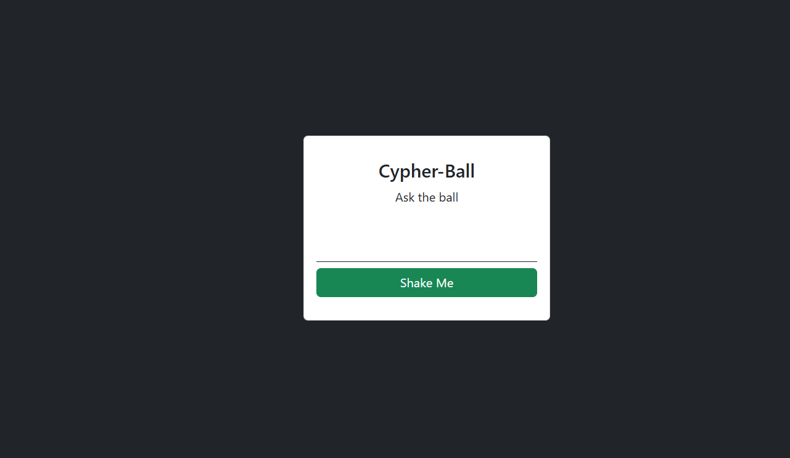

# Cypher Ball 🔮

Do you remember the iconic 'Magic 8 Ball'? In where you can ask some random questions for fun then you get random answer or validations. Come a take a look at this web-based version of it, on where you can ask question and have random answer 🎉

---

### What's new?
- 🔮 Web-Based 'Magic 8 Ball'
- 🔮 Ask random question and get random answers
- 🔮 Minimalist design
- 🔮 Easy to use and deploy

### Cypher Ball Preview Platform
##### Question Platform

##### Answer Platform


### How to use?
1. Enable environment
```bash
py -m venv .venv
```
```bash
.venv\Scripts\activate
```
2. Requirements Installation
```bash
pip install -r requirements.txt
```
3. Activate the API
```bash
uvicorn api_endpoint:app
```
4. Run the program
```bash
python app.py
```
5. Have Fun 🎉

---
##### Cypher Ball is your bestfriend 🔮